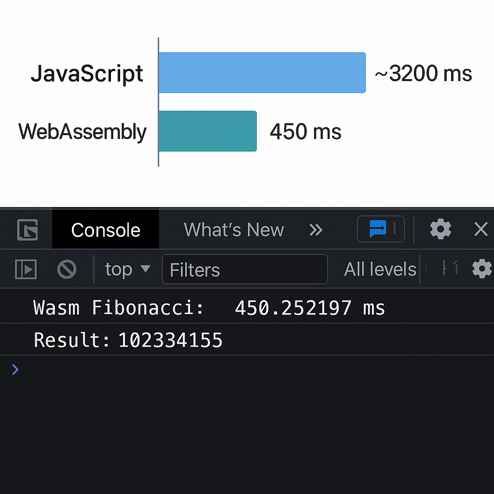

# TUGAS ARTIKEL PEMROGRAMAN WEB
|Nama|NIM|Kelas|Matkul|
|-----|-----|-----|-----|
|KEMASRAFIRAMADHAN|312310346|TI 23A.4|Pemog Web|

## ESKOERIMEN
Eksperimen: Perbandingan Kinerja Perhitungan Fibonacci
Untuk memahami perbedaan kinerja antara JavaScript dan WebAssembly, saya melakukan eksperimen sederhana: membandingkan waktu eksekusi fungsi Fibonacci rekursif pada kedua platform. Fungsi Fibonacci rekursif dipilih karena merupakan contoh klasik dari beban komputasi yang berat dan eksponensial.
Implementasi JavaScript
Pertama, saya mengimplementasikan fungsi Fibonacci rekursif dalam JavaScript:

## CODINGAN
javascript
function fibonacciJS(n) {
  if (n <= 1) return n;
  return fibonacciJS(n - 1) + fibonacciJS(n - 2);
}
Implementasi WebAssembly dengan Rust
Untuk WebAssembly, saya menggunakan Rust sebagai bahasa sumber karena dukungan toolingnya yang baik:
rust
// fibonacci.rs
#[no_mangle]
pub fn fibonacci(n: i32) -> i32 {
  if n <= 1 {
    return n;
  }
  fibonacci(n - 1) + fibonacci(n - 2)
}
Kemudian saya mengkompilasi kode Rust menjadi WebAssembly menggunakan perintah:
bash
rustc --target wasm32-unknown-unknown -O fibonacci.rs -o fibonacci.wasm
Integrasi WebAssembly dengan JavaScript
Untuk menggunakan modul WebAssembly dalam aplikasi web, saya membuat fungsi loader:
javascript
async function loadWasm() {
  const response = await fetch('fibonacci.wasm');
  const buffer = await response.arrayBuffer();
  const wasmModule = await WebAssembly.instantiate(buffer);
  return wasmModule.instance.exports;
}

// Penggunaan
loadWasm().then(wasm => {
  console.time('Wasm Fibonacci');
  const result = wasm.fibonacci(40);
  console.timeEnd('Wasm Fibonacci');
  console.log('Result:', result);
});

## HASIL 

